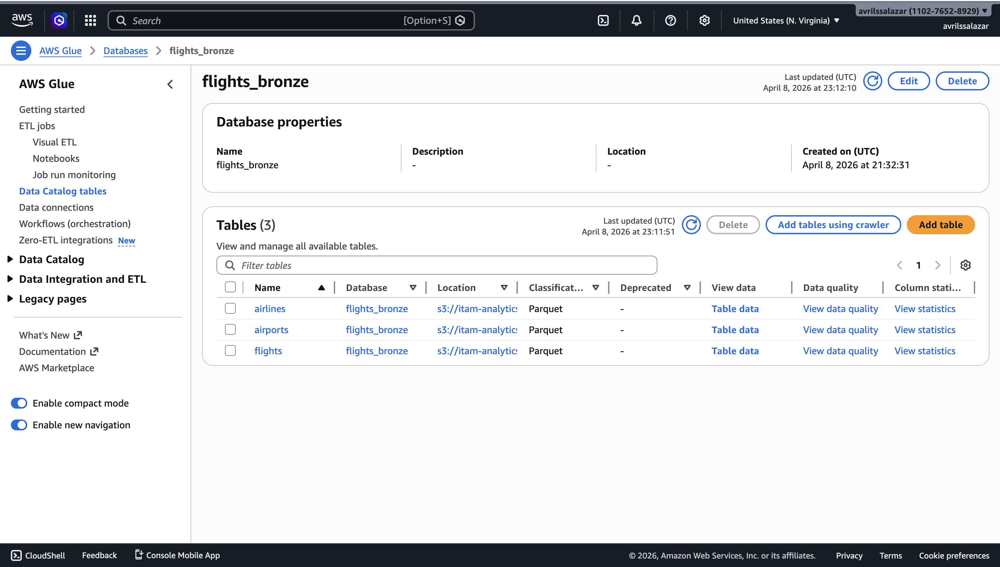
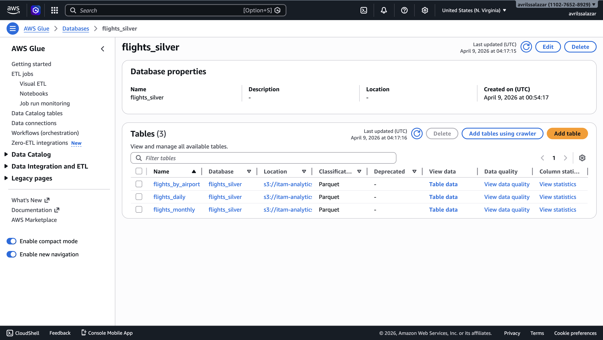
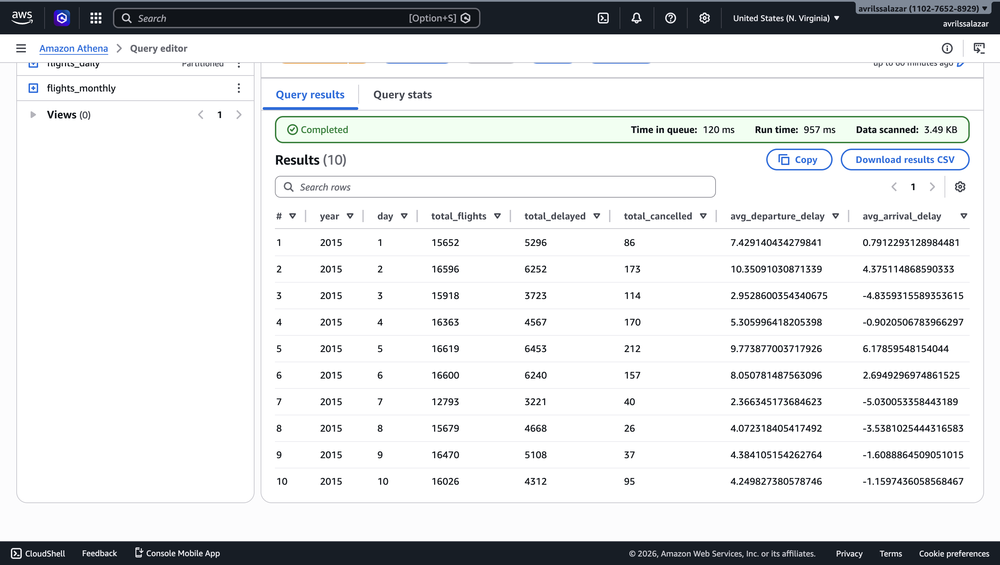
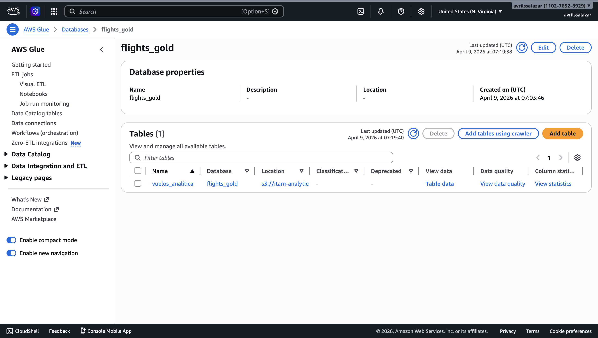
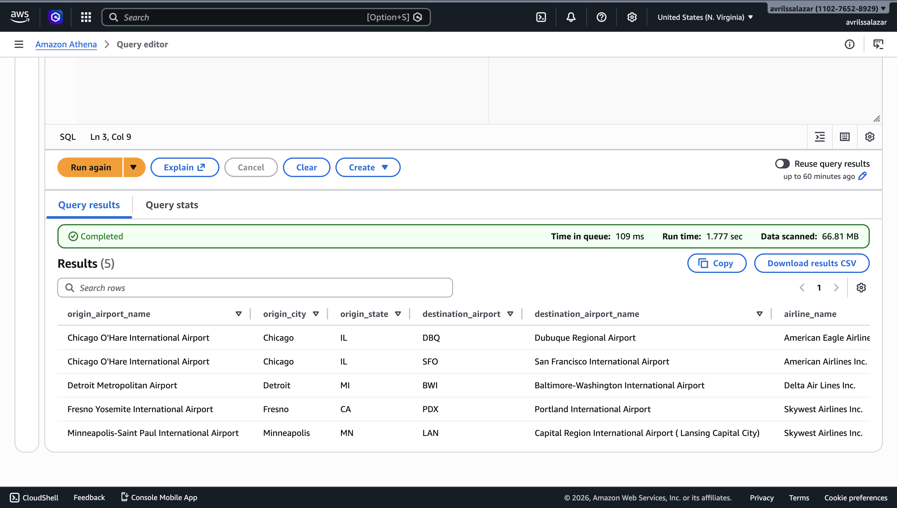
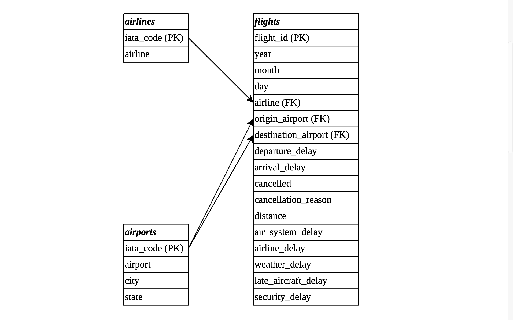
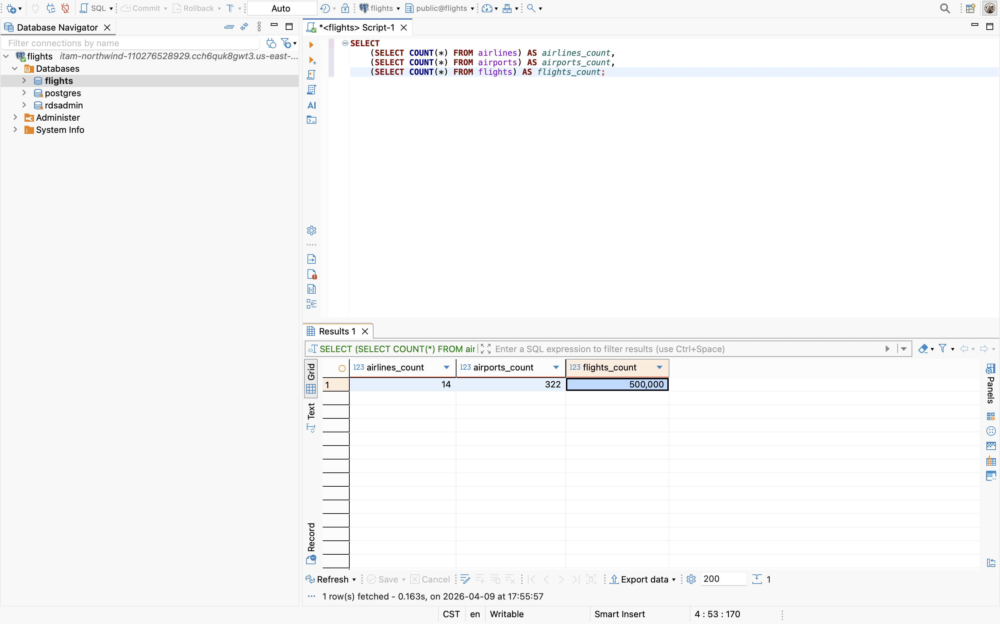

# Tarea 08: Data Engineering End-to-End — Flights Dataset

Un análisis contesta una pregunta. Un pipeline de datos la contesta todos los días, de forma confiable, sin que nadie tenga que intervenir. En esta tarea se construye ese pipeline sobre el dataset de vuelos domésticos en Estados Unidos durante 2015, pasando por una arquitectura Medallion en S3 y Athena, un modelo relacional en PostgreSQL y la base para el análisis posterior en notebook.

## Objetivo

Se trabaja sobre un dataset de vuelos de 2015 para construir un pipeline de datos end-to-end. El repositorio integra scripts ETL que implementan la arquitectura Bronze, Silver, y Gold sobre S3 y Athena con AWS Glue Data Catalog, además de un modelo relacional en PostgreSQL provisionado con CloudFormation y cargado con SQLAlchemy. Esta primera parte deja lista la infraestructura, el procesamiento y la base relacional para continuar con las consultas analíticas, visualizaciones y análisis estadístico en los siguientes pasos.

## Estructura agregada al repositorio

```text
.
├── docs
│   ├── erd-flights.drawio
│   ├── erd-flights.png
│   └── images
│       ├── 01_rds_stack.png
│       ├── 02_glue_bronze.png
│       ├── 03_glue_silver.png
│       ├── 04_glue_gold.png
│       ├── 05_athena_query.png
│       ├── 06_athena_join.png
│       ├── 07_erd.png
│       └── 08_db_counts.png
├── etl
│   ├── bronze.py
│   ├── gold.py
│   └── silver.py
├── infra
│   └── rds-flights.yaml
├── postgres
│   ├── __init__.py
│   ├── load_data.py
│   ├── models.py
│   └── setup_db.py
├── .gitignore
└── README.md
```

## Archivos principales

### etl/bronze.py

Implementa la capa Bronze. Lee los archivos CSV locales, crea la base `flights_bronze` en Glue y escribe cada tabla en S3 en su propio prefijo. También registra automáticamente el schema en el Glue Data Catalog.

### etl/silver.py

Implementa la capa Silver. Lee la tabla `flights` desde Bronze, limpia tipos, procesa los datos por chunks para evitar problemas de memoria y construye las tablas agregadas `flights_daily`, `flights_monthly` y `flights_by_airport` en formato Parquet con compresión Snappy.

### etl/gold.py

Implementa la capa Gold. Crea la base `flights_gold`, elimina la tabla analítica si ya existe y ejecuta un CTAS en Athena para construir `vuelos_analitica` a partir de las tablas de Bronze y los catálogos de aerolíneas y aeropuertos.

### infra/rds-flights.yaml

Template de CloudFormation utilizado para provisionar PostgreSQL en RDS junto con la read replica requerida para las consultas analíticas.

### postgres/models.py

Define el esquema relacional con SQLAlchemy 2.0 para las tablas `airlines`, `airports` y `flights`, incluyendo claves primarias y foráneas.

### postgres/setup_db.py

Crea las tablas en PostgreSQL utilizando el modelo definido en SQLAlchemy y el endpoint primario de RDS.

### postgres/load_data.py

Carga los archivos CSV a PostgreSQL respetando el orden correcto de inserción: `airlines`, `airports` y `flights`. Para `flights` se cargan únicamente los primeros 500,000 registros.


## Inicialización del repositorio

Se creó el repositorio público `flights-data-engineering-a`, se generó la rama `development` a partir de `main` y se trabajó sobre la rama `feature/data-engineering-flights`. Los datos se descargaron desde el bucket público del curso y se descomprimieron localmente en la carpeta `data/`. Después se agregó `data/` a `.gitignore` para evitar subir los CSVs al repositorio.


## ETL — Arquitectura Medallion

Se construyó el pipeline completo Bronze, Silver y Gold como scripts Python ejecutables desde terminal. Los scripts utilizan `logging`, `argparse`, validaciones con `assert`, manejo de errores con `try/except` y `sys.exit(1)`, además de escritura idempotente para permitir múltiples ejecuciones sin duplicar datos.

### Bronze — Ingesta sin transformaciones

En Bronze se cargaron los tres archivos del dataset a S3 sin transformaciones, preservando la fuente original de verdad. Antes de escribir las tablas, se creó la base `flights_bronze` en Glue con `exist_ok=True`. Cada tabla se escribió en su propio prefijo bajo `flights/bronze/` y quedó registrada automáticamente en el Glue Data Catalog.

La evidencia de esta capa muestra que `flights_bronze` contiene correctamente las tres tablas requeridas: `airlines`, `airports` y `flights`.



### Silver — Transformaciones y agregaciones

En Silver se transformaron los datos de Bronze a formato Parquet + Snappy y se construyeron tres tablas agregadas: `flights_daily`, `flights_monthly` y `flights_by_airport`. Para evitar errores de memoria durante la lectura de `flights.csv`, el procesamiento se hizo por chunks. Antes de escribir cada tabla, se validó que el DataFrame no estuviera vacío y que contuviera las columnas esperadas.

La tabla `flights_daily` quedó particionada por `MONTH`, mientras que `flights_monthly` y `flights_by_airport` se escribieron en modo overwrite. Después se validó también en Athena que las agregaciones de Silver respondieran correctamente.





### Gold — Tabla analítica

En Gold se creó la base `flights_gold` y se construyó la tabla `vuelos_analitica` con un CTAS en Athena. Esta tabla desnormaliza los datos de vuelos y los enriquece con los catálogos de aerolíneas y aeropuertos, resolviendo nombres descriptivos para origen, destino y aerolínea.

La validación final se realizó con una consulta de muestra para comprobar que los nombres de aerolínea y aeropuerto quedaran correctamente registrados.






## Diagrama Entidad-Relación (ERD) y PostgreSQL

En esta parte se modeló el esquema relacional del dataset, se provisionó PostgreSQL en AWS y se cargaron los datos requeridos para las consultas de los pasos posteriores.

### Provisionamiento con CloudFormation

Se copió el template del demo de clase a `infra/rds-flights.yaml`, se ajustó el parámetro `DBName` a `flights` y se desplegó el stack `itam-flights-rds` desde la consola de CloudFormation. El stack se creó con read replica, y se verificaron los outputs con el endpoint primario y el endpoint de la réplica.


### Diseño del ERD

Se construyó el diagrama entidad-relación en draw.io con las tres entidades solicitadas: `airlines`, `airports` y `flights`. El modelo incluye claves primarias, claves foráneas y la doble referencia de `flights` hacia `airports` para origen y destino.

Además del screenshot, se guardó también el archivo fuente `docs/erd-flights.drawio` y la exportación como imagen en `docs/erd-flights.png`.



### Creación de tablas con SQLAlchemy

Se definió el modelo con SQLAlchemy 2.0 en `postgres/models.py`, respetando el ERD anterior. Luego, mediante `postgres/setup_db.py`, se conectó al endpoint primario de RDS y se crearon las tablas `airlines`, `airports` y `flights` en PostgreSQL.

### Carga de datos en PostgreSQL

Los datos se cargaron con el patrón de bulk insert de SQLAlchemy 2.0. El orden de inserción respetó las dependencias entre tablas: primero `airlines`, después `airports` y finalmente `flights`. Para `flights` se cargaron únicamente los primeros 500,000 registros, tal como lo especificaba la tarea.

La carga se validó en DBeaver mediante un `SELECT COUNT(*)` por tabla. Los resultados finales fueron 14 registros en `airlines`, 322 registros en `airports` y 500,000 registros en `flights`.




## Dependencias principales

Durante esta primera parte del proyecto se utilizaron principalmente las siguientes librerías y herramientas:

- pandas
- awswrangler
- sqlalchemy
- psycopg2
- boto3
- AWS Glue
- AWS Athena
- AWS RDS
- DBeaver

## Git Workflow

Se implementó una estrategia de branching alineada con el flujo de trabajo solicitado.

### Ramas principales

- `main`: versión estable
- `development`: rama de integración
- `feature/data-engineering-flights`: rama de trabajo para esta entrega